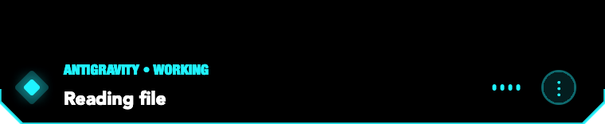
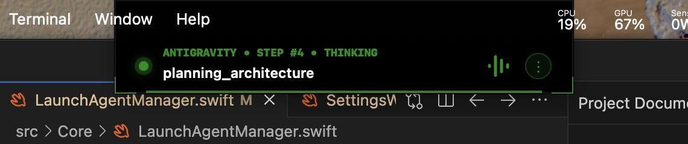
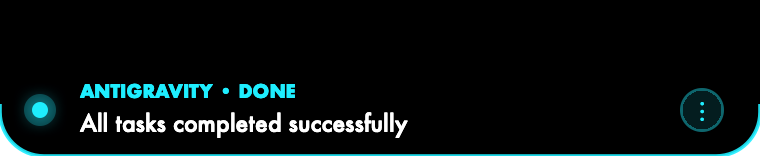
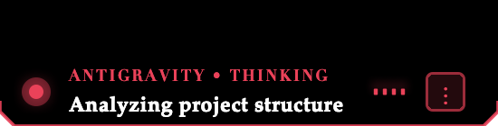
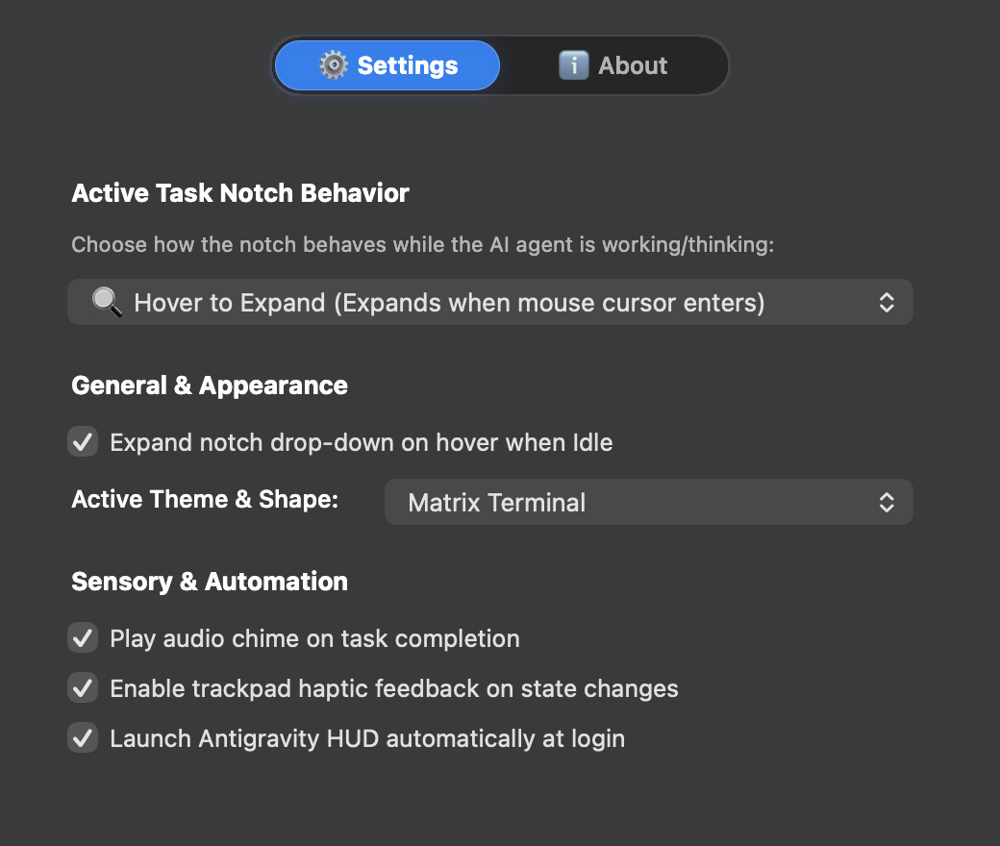
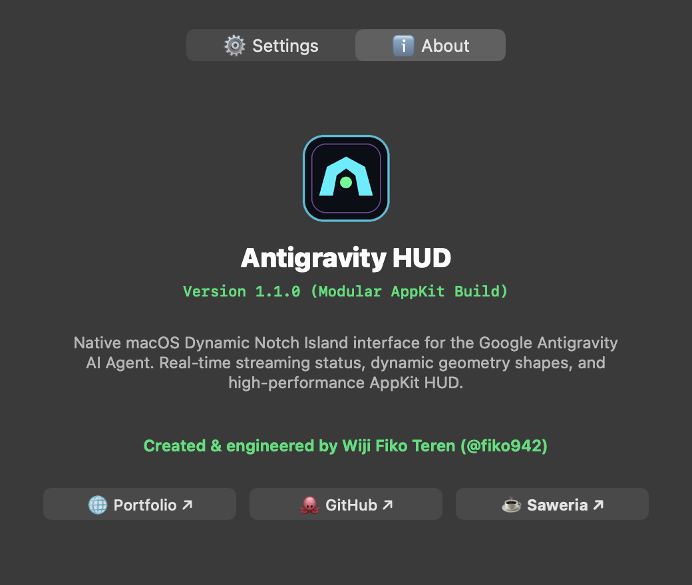

# 🏝️ Antigravity HUD (macOS Dynamic Notch Island)

<p align="center">
  
</p>

<p align="center">
  <b>A sleek, native macOS Dynamic Island widget for Google Antigravity AI Agent that lives seamlessly inside your MacBook's camera notch.</b>
</p>

<p align="center">
  <a href="https://github.com/fiko942/antigravity-hud/releases"></a>
  <a href="https://developer.apple.com/swift/"></a>
  <a href="./LICENSE"></a>
  <a href="https://wijifikoteren.streampeg.com"></a>
  <a href="https://saweria.co/fiko942"></a>
</p>

---

## 📸 Live Visual Showcase

<p align="center">
  <b>⚡ Cyberpunk 2077 (Active Working State with Dynamic Glitch & Neural Waveform)</b><br>
  
</p>

<p align="center">
  <b>💻 Matrix Terminal (Active Thinking State with Bracket Crosshairs)</b><br>
  
</p>

<p align="center">
  <b>🌅 Sunset Synthwave (Task Completed State with Horizon Glow)</b><br>
  
</p>

<p align="center">
  <b>🧛 Dracula Gothic (Stepped Micro-Bevel Contour)</b><br>
  
</p>

<p align="center">
  
  &nbsp;&nbsp;
  
</p>

---

## ✨ Key Features & Highlights

- 🏝️ **Native Hardware Notch Integration**: Aligns perfectly with Liquid Retina XDR hardware camera notch geometry (`Y = 924...956`) across Apple Silicon MacBooks (M1 / M2 / M3 / M4).
- ⬛ **100% Solid OLED Pure Black (`drawRect`)**: Zero alpha bleeding or menu bar bleed-through. 100% opaque WindowServer backing store.
- 📐 **Dynamic Notch Shape-Morphing**:
  - **`General (Classic)`**: Apple-style smooth superellipse ($R = 18\text{pt}$).
  - **`Cyberpunk 2077`**: Angular $45^\circ$ sci-fi mecha chamfers + active RGB chromatic scanline glitch.
  - **`Matrix Terminal`**: Digital squared terminal corners with `[ ]` bracket crosshairs.
  - **`Sunset Synthwave`**: Ultra-soft continuous pill curve ($R = 22\text{pt}$).
  - **`Dracula Gothic`**: Stepped $45^\circ$ gothic micro-bevels with blood-red and royal violet glow.
- ⚙️ **Comprehensive Preferences & About Window**:
  - **Active Task Behavior Modes**: Choose between *Click to Expand (Distraction Free)*, *Hover to Expand*, or *Always Expanded*.
  - **Idle Hover Control**: Toggle hover drop-down when agent is idle.
  - **Launch at Login**: Auto-register/unregister macOS `LaunchAgent` daemon.
- 🔊 **Sensory Audio-Haptic Engine**: Tactile trackpad haptic pulses on activity changes and subtle completion audio chimes.
- ⚡ **Neural Equalizer Waveform**: 4-bar dynamic audio/cyberizer animation rendered with CoreAnimation (`CAKeyframeAnimation`).
- 🔒 **Kernel Mutex**: Single-instance lock via `flock` on `/tmp/antigravity-hud.lock` prevents duplicate processes.
- 🧠 **Global Real-Time Brain Watcher**: 100ms async polling monitoring `~/.gemini/antigravity-ide/brain/` globally across all active sessions.

---

## 🎨 Interactive State Palette

| State | Default Color | Interaction Behavior | Description |
| :--- | :--- | :--- | :--- |
| **`READY` / `IDLE`** | 🟢 Emerald (`#00E073`) | Collapsed rim, hover expands | AI is standing by for user prompt |
| **`THINKING`** | 🟣 Neon Purple (`#BF5AF2`) | Pulsing rim & waveform | Planner reasoning & structuring steps |
| **`WORKING`** | 🔵 Electric Cyan (`#00F0FF`) | Equalizer wave & active tool path | Editing files, running commands, reading logs |
| **`DONE`** | 🟢 Bright Emerald (`#34D399`) | Smooth 3.5s finish confirmation | Task successfully completed |

---

## 📦 Installation

### Option 1: Download Pre-built DMG (Recommended)
1. Download the latest `AntigravityHUD-v1.0.0.dmg` from [GitHub Releases](https://github.com/fiko942/antigravity-hud/releases).
2. Open the DMG and drag **`Antigravity HUD.app`** into your **`Applications`** folder.
3. Launch `Antigravity HUD.app` from `/Applications` or Spotlight (`Cmd + Space`).
4. That's it! It automatically registers to start silently on login.

### Option 2: Build from Source
```bash
# Clone repository
git clone https://github.com/fiko942/antigravity-hud.git
cd antigravity-hud

# Build the native app bundle and DMG installer
bash build.sh

# Launch the app
open build/AntigravityHUD.app
```

---

## 🛠️ Modular Architecture

```
antigravity-hud/
├── src/
│   ├── App/
│   │   └── AppDelegate.swift        # Main lifecycle, mouse tracking, & context menu
│   ├── Brain/
│   │   ├── AgentActivity.swift      # Activity data model
│   │   └── BrainWatcher.swift       # Async JSONL seek & log parsing
│   ├── Core/
│   │   ├── LaunchAgentManager.swift # Auto-register / uninstall login daemon
│   │   ├── SensoryManager.swift     # Trackpad haptics & completion chimes
│   │   ├── SettingsManager.swift    # Persistent configuration engine
│   │   └── SingleInstanceMutex.swift# Kernel mutex flock locking
│   ├── Themes/
│   │   ├── ThemeManager.swift       # State color palettes & config persistence
│   │   └── ThemeStyle.swift         # Dynamic notch geometry shapes & glitch specs
│   ├── UI/
│   │   ├── AntigravityNotchPanel.swift    # AppKit floating panel at Level 102
│   │   ├── CyberEqualizerLayer.swift      # 4-bar CoreAnimation waveform
│   │   ├── GlitchOverlayLayer.swift       # Cyberpunk chromatic shift glitch
│   │   ├── NotchIslandContentView.swift   # Dynamic notch shape drawing & kebab menu
│   │   └── SettingsWindowController.swift # Preferences & About window
│   └── main.swift                   # Clean application entry point
├── Resources/
│   ├── AppIcon.icns                 # High-DPI macOS application icon
│   ├── Info.plist                   # macOS bundle metadata
│   └── theme.example.json           # Example theme configuration
├── docs/
│   ├── ARCHITECTURE.md              # Engineering deep dive & hardware notch specs
│   └── assets/                      # High-res screenshots and showcase images
├── build.sh                         # Production modular compiler & DMG generator
├── package.json                     # Tooling & metadata
├── LICENSE                          # MIT License
└── README.md
```

---

## 👤 Author & Credits

Created and engineered with ❤️ by **[Wiji Fiko Teren](https://wijifikoteren.streampeg.com)** ([@fiko942](https://github.com/fiko942)).
- 🌐 **Portfolio**: [https://wijifikoteren.streampeg.com](https://wijifikoteren.streampeg.com)
- 🐙 **GitHub**: [@fiko942](https://github.com/fiko942)

---

## ☕ Support & Donations

If you enjoy using **Antigravity HUD** and want to support ongoing development, maintenance, and new features, you can buy me a coffee via **Saweria**:

<p align="center">
  <a href="https://saweria.co/fiko942">
    
  </a><br>
  👉 <b><a href="https://saweria.co/fiko942">saweria.co/fiko942</a></b>
</p>

---

## 📄 License

This project is licensed under the [MIT License](./LICENSE) - see the LICENSE file for details.
