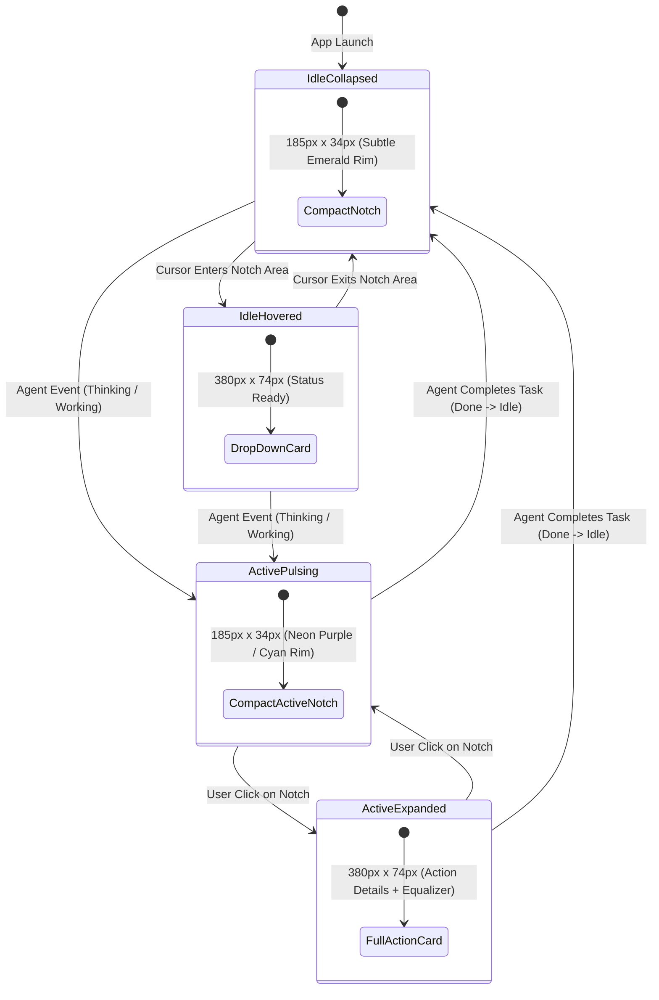

# 📐 Antigravity HUD Architecture

This document describes the internal engineering design of **Antigravity HUD**, how it integrates directly with macOS hardware notch geometry, AppKit window layers, and the Antigravity AI Agent real-time brain stream.

---

## 1. Hardware Notch Geometry & Display Alignment

MacBook Liquid Retina XDR displays feature physical camera notches at the top center of the screen:
- **Screen Bounds (Typical 14" / 16")**: `1470 × 956` points (scaled) / native Retina.
- **Physical Notch Cutout Width**: `179.0pt` (centered at `X = midX = 735.0`).
- **Physical Notch Cutout Height**: `32.0pt` to `34.0pt` (`Y = 924.0...956.0`).

### Coordinate System & Window Level
- **Coordinate Anchoring**: The custom `NSView` sets `override var isFlipped: Bool { true }` so that `(0, 0)` refers to the top-left edge of the window at the top bezel.
- **Window Layering**: Standard `NSWindow.Level.floating` is overridden to `NSWindow.Level(rawValue: 102)` (above system Menu Bar items and auxiliary window layers) so that the HUD properly renders on top of the notch area without macOS pushing it below the menu bar.
- **Constraint Override**: `override func constrainFrameRect(_ frameRect: NSRect, to screen: NSScreen?) -> NSRect` returns `frameRect` unchanged, bypassing AppKit's automatic menu bar collision pushdown.

---

## 2. Solid OLED Black Rendering (`drawRect`)

To prevent macOS compositor blending and transparency bleed-through over underlying Menu Bar items (such as `File`, `Edit`, `Terminal`, `Window`, `Help`, and status menus):
- The content view overrides `func draw(_ dirtyRect: NSRect)`.
- It executes `NSBezierPath.fill()` with `NSColor.black.setFill()`, drawing 100% solid, non-transparent pixels directly into the WindowServer backing store.
- Glowing neon contour borders are drawn with high-precision anti-aliased Bézier paths matching the status theme color.

---

## 3. Dual Interaction State Machine

---

## 4. Single-Instance Mutex & Auto-LaunchAgent

1. **Kernel Mutex**:
   - Uses `flock(fd, LOCK_EX | LOCK_NB)` on `/tmp/antigravity-hud.lock`.
   - Guaranteed zero duplicate processes even if invoked multiple times.
2. **Auto-LaunchAgent**:
   - On launch, checks for existence of `~/Library/LaunchAgents/com.google.antigravity.hud.plist`.
   - If missing, automatically generates the plist pointing to `/Applications/AntigravityHUD.app/Contents/MacOS/AntigravityHUD` and registers via `launchctl load -w`.
