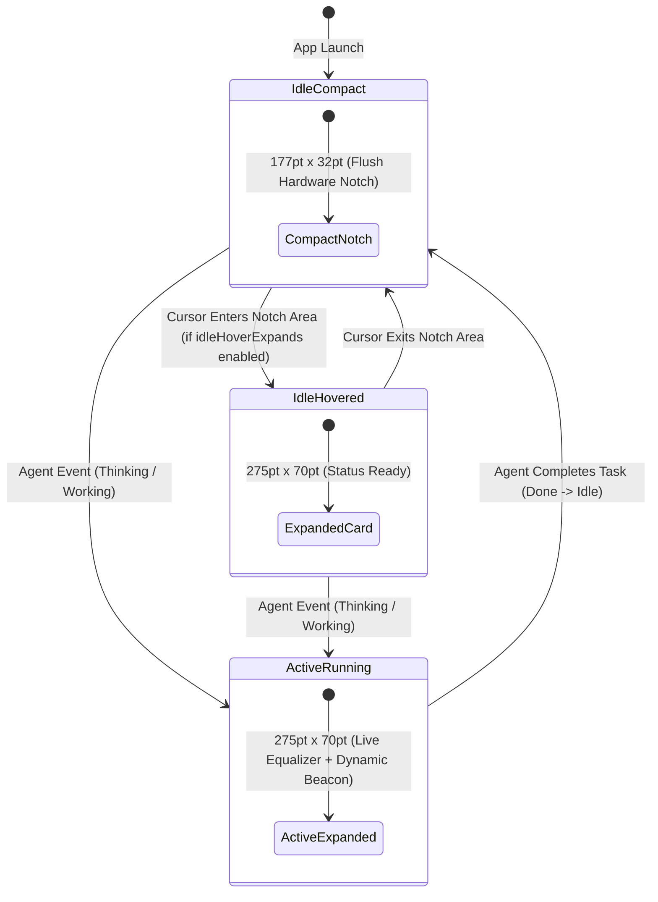

# 📐 Antigravity HUD Architecture

This document describes the internal engineering design of **Antigravity HUD**, how it integrates directly with macOS hardware notch geometry, AppKit window layers, and the Antigravity AI Agent real-time brain stream.

---

## 1. Hardware Notch Geometry & Display Alignment

MacBook Liquid Retina XDR displays feature physical camera notches at the top center of the screen:
- **Screen Bounds (Typical 14" / 16")**: `1470 × 956` points (scaled) / native Retina.
- **Physical Notch Cutout Width**: `177.0pt` to `179.0pt` (centered at `X = midX`).
- **Physical Notch Cutout Height**: `26.0pt` to `34.0pt`.

### Coordinate System & Window Level
- **Coordinate Anchoring**: The custom `NSView` sets `override var isFlipped: Bool { true }` so that `(0, 0)` refers to the top-left edge of the window at the top bezel.
- **Window Layering**: Standard `NSWindow.Level.floating` is overridden to `NSWindow.Level(rawValue: 102)` (above system Menu Bar items and auxiliary window layers) so that the HUD properly renders on top of the notch area without macOS pushing it below the menu bar.
- **Constraint Override**: `override func constrainFrameRect(_ frameRect: NSRect, to screen: NSScreen?) -> NSRect` returns `frameRect` unchanged, bypassing AppKit's automatic menu bar collision pushdown.

---

## 2. Solid OLED Black Rendering (`drawRect`)

To prevent macOS compositor blending and transparency bleed-through over underlying Menu Bar items:
- The content view overrides `func draw(_ dirtyRect: NSRect)`.
- It executes `NSBezierPath.fill()` with `NSColor.black.setFill()`, drawing 100% solid, non-transparent pixels directly into the WindowServer backing store.
- Glowing neon contour borders and custom theme geometries are drawn with high-precision anti-aliased Bézier paths matching the active status theme color.

---

## 3. Dynamic Interaction State Machine & Task Modes



### Active Task Behavior Modes:
1. **`hoverExpands`** (Default): Expands when hovered by cursor; compact otherwise.
2. **`alwaysExpanded`**: Stays expanded whenever an agent task is active.
3. **`clickOnly`**: Stays compact during active tasks until explicitly clicked.

---

## 4. Native SQLite3 Storage Architecture

- **Engine**: SQLite3 in **Write-Ahead Logging (WAL)** mode.
- **Database Path**: `~/.gemini/antigravity-hud/settings.sqlite`.
- **Latency**: Synchronous read/write operations `< 0.1ms`.
- **Schema**:
  ```sql
  CREATE TABLE IF NOT EXISTS app_settings (
      key TEXT PRIMARY KEY,
      value TEXT NOT NULL,
      updated_at DATETIME DEFAULT CURRENT_TIMESTAMP
  );
  ```
- **Atomicity**: Atomic commits ensure settings survive application restarts and macOS power cycles.

---

## 5. Automated Font Registration Engine (`FontManager.swift`)

- In-process CoreText registration via `CTFontManagerRegisterFontURLs(_: .process, true, ...)`.
- Automatic synchronization of bundled `.ttf` / `.otf` fonts to `~/Library/Fonts/`.
- Fallback font cascading to ensure zero missing glyphs or UI layout breakages.

---

## 6. Multi-Theme Geometry, Equalizer & Sensory Catalog (7 Themes)

| Theme | Geometry Contour | Equalizer Waveform | Kebab Button | Completion Chime | Haptic Pattern |
| :--- | :--- | :--- | :--- | :--- | :--- |
| **`macOS Classic (Dark)`** | Apple Superellipse | `.classicWave` | `.capsuleCircle` | `Glass` | `.generic` |
| **`macOS Classic (Light)`** | Platinum Porcelain | `.classicWave` | `.capsuleCircle` | `Glass` | `.generic` |
| **`Cyberpunk 2077`** | $45^\circ$ Mecha Chamfers | `.cyberpunkBlocks` | `.cyberChamfer` | `Funk` | `.levelChange` |
| **`Matrix Terminal`** | Square Terminal Box | `.matrixBinary` | `.matrixBracket` | `Morse` | `.levelChange` |
| **`Sunset Synthwave`** | Continuous Smooth Pill | `.synthwavePillars` | `.neonRing` | `Hero` | `.generic` |
| **`Dracula Gothic`** | Stepped Gothic Bevels | `.draculaSpikes` | `.gothicDiamond` | `Basso` | `.generic` |
| **`Fineline Dark`** | $1.0\text{pt}$ Hairline Constellation | `.finelineNeedle` | `.finelineHairline` | `Tink` | `.alignment` |

---

## 7. Dynamic Notch Dimension Morphing

- **Customizable Dimension Ranges**:
  - `expandedWidth`: `120.0pt ... 600.0pt` (Default: `275.0pt`)
  - `expandedHeight`: `30.0pt ... 80.0pt` (Default: `44.0pt`)
  - `compactWidth`: `120.0pt ... 300.0pt` (Default: `177.0pt`)
  - `compactHeight`: `0.0pt ... 25.0pt` (Default: `6.0pt`)
