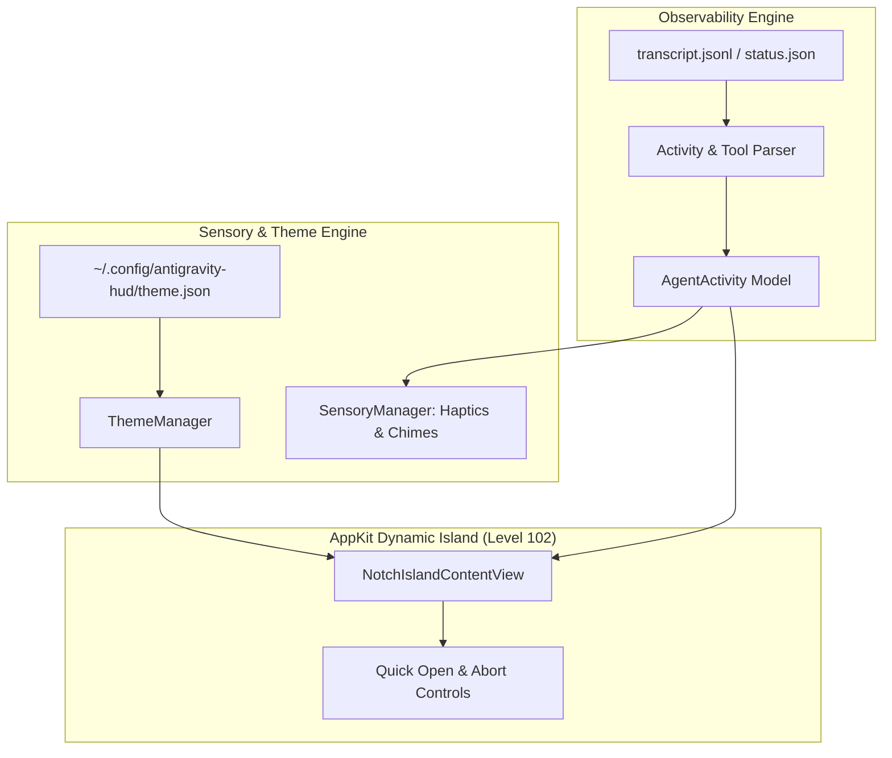

# 🏝️ Antigravity Modular Super-HUD Implementation Plan

> **For agentic workers:** REQUIRED SUB-SKILL: Use superpowers:subagent-driven-development to implement this plan task-by-task. Steps use checkbox (`- [ ]`) syntax for tracking.

**Goal:** Transform the Antigravity HUD into a rich, interactive Super-HUD featuring real-time tool argument parsing, step index counters, audio-haptic sensory feedback, dynamic neon theming, and quick action controls (file opener & abort trigger).

**Architecture:** Extend `src/main.swift` with modular subsystems: `ThemeManager` for JSON/preset color schemes and audio-haptic toggles, `SensoryManager` for haptic pulses and completion audio chimes, `ActivityParser` for JSONL tool extraction (`TargetFile`, `CommandLine`, `step_index`), and updated `NotchIslandContentView` with interactive action controls.

**Architecture Diagram:**



**Tech Stack:** Swift 6, AppKit (`NSPanel`, `NSView`, `NSTextField`, `NSBezierPath`), QuartzCore / CoreAnimation (`CAKeyframeAnimation`, `CALayer`), `NSHapticFeedbackManager`, `NSSound`, `NSWorkspace`.

## Global Constraints
- Target macOS: macOS 12.0+ (Universal Apple Silicon & Intel).
- Zero external package dependencies (pure Swift + AppKit + CoreGraphics/CoreAnimation).
- Target CPU standby usage `< 0.2%`.
- 100% Solid OLED pure black rendering (`drawRect` non-transparent pixel backing).
- Preserve single-instance mutex (`flock` on `/tmp/antigravity-hud.lock`).

---

### Task 1: Implement Dynamic Theme Engine (`ThemeManager`)

**Files:**
- Modify: `src/main.swift`

**Interfaces:**
- Produces: `ThemeManager` singleton providing `themeColor(for state: String) -> NSColor`, `soundEnabled: Bool`, and `hapticsEnabled: Bool`.

- [ ] **Step 1: Define `ThemePalette` and `ThemeManager` in `src/main.swift`**

```swift
struct ThemePalette {
    var idle: NSColor
    var thinking: NSColor
    var working: NSColor
    var done: NSColor
}

class ThemeManager {
    static let shared = ThemeManager()
    
    var soundEnabled: Bool = true
    var hapticsEnabled: Bool = true
    var currentPalette: ThemePalette
    
    private init() {
        // Default Cyberpunk Preset
        self.currentPalette = ThemePalette(
            idle: NSColor(red: 0.0, green: 0.88, blue: 0.45, alpha: 1.0),     // #00E073
            thinking: NSColor(red: 0.75, green: 0.35, blue: 1.0, alpha: 1.0),  // #BF5AF2
            working: NSColor(red: 0.0, green: 0.94, blue: 1.0, alpha: 1.0),   // #00F0FF
            done: NSColor(red: 0.2, green: 0.95, blue: 0.45, alpha: 1.0)      // #34D399
        )
        loadUserTheme()
    }
    
    func loadUserTheme() {
        let configPath = ("~/.config/antigravity-hud/theme.json" as NSString).expandingTildeInPath
        guard let data = try? Data(contentsOf: URL(fileURLWithPath: configPath)),
              let json = try? JSONSerialization.jsonObject(with: data) as? [String: Any] else { return }
        
        if let sound = json["soundEnabled"] as? Bool { self.soundEnabled = sound }
        if let haptics = json["hapticsEnabled"] as? Bool { self.hapticsEnabled = haptics }
        
        if let active = json["activeTheme"] as? String,
           let themes = json["themes"] as? [String: [String: String]],
           let themeColors = themes[active] {
            self.currentPalette = ThemePalette(
                idle: colorFromHex(themeColors["idle"]) ?? self.currentPalette.idle,
                thinking: colorFromHex(themeColors["thinking"]) ?? self.currentPalette.thinking,
                working: colorFromHex(themeColors["working"]) ?? self.currentPalette.working,
                done: colorFromHex(themeColors["done"]) ?? self.currentPalette.done
            )
        }
    }
    
    func color(for state: String) -> NSColor {
        switch state {
        case "thinking": return currentPalette.thinking
        case "working": return currentPalette.working
        case "done": return currentPalette.done
        default: return currentPalette.idle
        }
    }
    
    private func colorFromHex(_ hexString: String?) -> NSColor? {
        guard let hex = hexString?.trimmingCharacters(in: CharacterSet.alphanumerics.inverted) else { return nil }
        var int: UInt64 = 0
        Scanner(string: hex).scanHexInt64(&int)
        let r, g, b: UInt64
        switch hex.count {
        case 6:
            (r, g, b) = ((int >> 16) & 0xFF, (int >> 8) & 0xFF, int & 0xFF)
            return NSColor(red: CGFloat(r) / 255.0, green: CGFloat(g) / 255.0, blue: CGFloat(b) / 255.0, alpha: 1.0)
        default:
            return nil
        }
    }
}
```

- [ ] **Step 2: Verify compilation**
Run: `swiftc -O src/main.swift -o /tmp/AntigravityHUD`
Expected: PASS

---

### Task 2: Implement Sensory Feedback Engine (`SensoryManager`)

**Files:**
- Modify: `src/main.swift`

**Interfaces:**
- Produces: `SensoryManager.shared.triggerHaptic(type:)` and `SensoryManager.shared.playCompletionChime()`

- [ ] **Step 1: Add `SensoryManager` in `src/main.swift`**

```swift
class SensoryManager {
    static let shared = SensoryManager()
    
    func triggerHaptic(pattern: NSHapticFeedbackManager.FeedbackPattern = .generic) {
        guard ThemeManager.shared.hapticsEnabled else { return }
        DispatchQueue.main.async {
            NSHapticFeedbackManager.defaultPerformer.perform(pattern, performanceTime: .now)
        }
    }
    
    func playCompletionChime() {
        guard ThemeManager.shared.soundEnabled else { return }
        DispatchQueue.main.async {
            NSSound(named: "Glass")?.play()
        }
    }
}
```

- [ ] **Step 2: Connect sensory triggers to state transitions in `AppDelegate`**
- [ ] **Step 3: Verify compilation**
Run: `swiftc -O src/main.swift -o /tmp/AntigravityHUD`
Expected: PASS

---

### Task 3: Granular Tool Argument & Step Ingestion Parser

**Files:**
- Modify: `src/main.swift`

**Interfaces:**
- Produces: `AgentActivity` structure containing `state`, `header`, `detail`, `activePath`, `isAnimated`.

- [ ] **Step 1: Define `AgentActivity` and enhance `scanLatestTranscriptDirectly()`**

```swift
struct AgentActivity {
    var state: String
    var header: String
    var detail: String
    var activePath: String?
    var isAnimated: Bool
}
```

- Extract `step_index` from JSON line.
- Extract `TargetFile`, `AbsolutePath`, `CommandLine` from `tool_calls`.
- Format clean relative paths:
  - If `TargetFile` is `/Users/fiko942/Desktop/antigravity-hud/src/main.swift`, display `Editing src/main.swift`.
  - Truncate long command lines cleanly with `...`.

- [ ] **Step 2: Test parser with live log entries and mock `/tmp/antigravity-status.json`**
- [ ] **Step 3: Verify compilation**
Run: `swiftc -O src/main.swift -o /tmp/AntigravityHUD`
Expected: PASS

---

### Task 4: UI Interactive Controls (File Opener & Emergency Abort)

**Files:**
- Modify: `src/main.swift` (`NotchIslandContentView` & `AppDelegate`)

**Interfaces:**
- Produces: Interactive buttons in expanded mode:
  - Clickable detail label / open action (`NSWorkspace.shared.open(...)`).
  - Abort button (`🛑 ABORT`) creating `/tmp/antigravity-abort.signal`.

- [ ] **Step 1: Add Abort button and Open button to `NotchIslandContentView`**
- [ ] **Step 2: Wire click actions in `AppDelegate`**
- [ ] **Step 3: Update `drawRect` and layout bounds to fit interactive controls seamlessly**
- [ ] **Step 4: Verify compilation**
Run: `swiftc -O src/main.swift -o /tmp/AntigravityHUD`
Expected: PASS

---

### Task 5: End-to-End Verification & Distribution Packaging

**Files:**
- Modify: `build.sh` (if needed)

- [ ] **Step 1: Run comprehensive mock state injection tests**
```bash
# Test Thinking
echo '{"state":"thinking","event":"UserInput","step":2}' > /tmp/antigravity-status.json
# Test Working on File
echo '{"state":"working","event":"replace_file_content","targetFile":"src/main.swift","step":3}' > /tmp/antigravity-status.json
# Test Done
echo '{"state":"done","event":"ResponseGenerated","step":4}' > /tmp/antigravity-status.json
```
- [ ] **Step 2: Compile release package and DMG installer**
Run: `bash build.sh`
Expected: `build/AntigravityHUD.app` and `build/AntigravityHUD-v1.0.0.dmg` generated successfully.
- [ ] **Step 3: Launch app and verify notch alignment and interaction**
