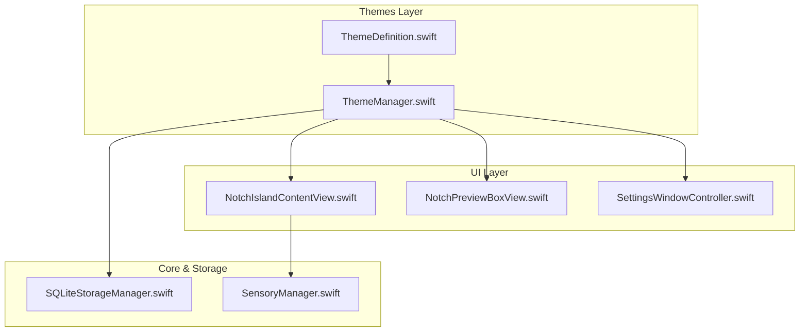

# Fineline Dark (Celestial Ink) Implementation Plan

> **For agentic workers:** REQUIRED SUB-SKILL: Use superpowers:subagent-driven-development to implement this plan task-by-task. Steps use checkbox (`- [ ]`) syntax for tracking.

**Goal:** Implement the new "Fineline Dark (Celestial Ink)" theme inspired by minimalist single-needle tattoo art with 1.0pt hairline contours, celestial constellation micro-dots, orbital ripple pulse animations, and Optima + Avenir Light typography.

**Architecture:** Extend `ThemeDefinition` with `.finelineConstellation` shape type and `.finelineCelestialOrbit` beacon style. Register the theme in `ThemeManager` with the Moonlight & Celestial Ink palette. Implement dedicated AppKit Bezier drawing and CoreAnimation orbital ripple layers in `NotchIslandContentView` and `NotchPreviewBoxView`.

**Architecture Diagram:**


**Tech Stack:** Swift, AppKit, CoreAnimation (`CAShapeLayer`, `CABasicAnimation`, `CAAnimationGroup`), SQLite3.

## Global Constraints
- Minimalist single-needle aesthetic: hairline stroke `1.0 pt`, matte onyx black background `#0A0A0C`.
- CoreAnimation layer transform safety: set `bounds` and `position` explicitly on transformed/rotated layers.
- Mandatory live build, replace `/Applications/AntigravityHUD.app`, and restart on completion.
- Local commit only; do NOT push to origin.

---

### Task 1: Extend Theme Definition and Register Fineline Dark

**Files:**
- Modify: [`src/Themes/ThemeDefinition.swift`](file:///Users/fiko942/Desktop/antigravity-hud/src/Themes/ThemeDefinition.swift)
- Modify: [`src/Themes/ThemeManager.swift`](file:///Users/fiko942/Desktop/antigravity-hud/src/Themes/ThemeManager.swift)

**Interfaces:**
- Consumes: `ThemeDefinition`, `ThemeShapeType`, `ThemeBeaconStyle`, `ThemePalette`
- Produces: `ThemeShapeType.finelineConstellation`, `ThemeBeaconStyle.finelineCelestialOrbit`, `ThemeManager.availableThemes` containing `"fineline"`

- [ ] **Step 1: Add enum cases in `ThemeDefinition.swift`**
```swift
public enum ThemeShapeType: String, Codable {
    case rounded
    case cyberpunkCut
    case matrixBracket
    case sunsetPill
    case draculaGothic
    case finelineConstellation
}

public enum ThemeBeaconStyle: String, Codable {
    case venturaSiriPulse
    case cyberpunkGlitchStrobe
    case matrixTerminalBlock
    case synthwaveHorizonHalo
    case draculaGothicHeartbeat
    case finelineCelestialOrbit
}
```

- [ ] **Step 2: Register Fineline Dark theme in `ThemeManager.swift`**
```swift
ThemeDefinition(
    id: "fineline",
    displayName: "Fineline Dark (Celestial Ink)",
    shapeType: .finelineConstellation,
    beaconStyle: .finelineCelestialOrbit,
    hasGlitchEffect: false,
    hasMatrixRain: false,
    isLightMode: false,
    headerFontName: "Optima-Bold",
    detailFontName: "Avenir-Light",
    palette: ThemePalette(
        idle: NSColor(red: 0.94, green: 0.93, blue: 0.91, alpha: 1.0),      // Pearl White / Ivory Ink #F0EFEA
        thinking: NSColor(red: 0.65, green: 0.55, blue: 0.98, alpha: 1.0),  // Mystic Nebula Lavender #A78BFA
        working: NSColor(red: 0.22, green: 0.74, blue: 0.97, alpha: 1.0),   // Celestial Cyan #38BDF8
        done: NSColor(red: 0.98, green: 0.75, blue: 0.14, alpha: 1.0)       // Aurora Star Gold #FBBF24
    )
)
```

- [ ] **Step 3: Test compilation**
Run: `swiftc -c src/Themes/*.swift -o /dev/null`
Expected: PASS

---

### Task 2: Implement Bezier Contours and Constellation Accents in NotchIslandContentView

**Files:**
- Modify: [`src/UI/NotchIslandContentView.swift`](file:///Users/fiko942/Desktop/antigravity-hud/src/UI/NotchIslandContentView.swift)

**Interfaces:**
- Consumes: `ThemeManager.shared.currentTheme`, `ThemeShapeType.finelineConstellation`, `ThemeBeaconStyle.finelineCelestialOrbit`
- Produces: Rendering of hairline 1.0pt superellipse contour with micro-star dots, and orbital ripple pulse animation.

- [ ] **Step 1: Add `.finelineConstellation` drawing in `draw(_:)`**
```swift
case .finelineConstellation:
    // Fineline Dark: Ultra-crisp 1.0pt single-needle hairline contour with celestial star dots
    let cornerRadius: CGFloat = isExpandedMode ? 16.0 : 7.0
    path.move(to: NSPoint(x: 0, y: 0))
    path.line(to: NSPoint(x: w, y: 0))
    path.line(to: NSPoint(x: w, y: h - cornerRadius))
    path.appendArc(withCenter: NSPoint(x: w - cornerRadius, y: h - cornerRadius), radius: cornerRadius, startAngle: 0, endAngle: 90, clockwise: false)
    path.line(to: NSPoint(x: cornerRadius, y: h))
    path.appendArc(withCenter: NSPoint(x: cornerRadius, y: h - cornerRadius), radius: cornerRadius, startAngle: 90, endAngle: 180, clockwise: false)
    path.close()

    if isExpandedMode {
        glowPath.move(to: NSPoint(x: 0, y: max(0, h - cornerRadius - 4)))
        glowPath.line(to: NSPoint(x: 0, y: h - cornerRadius))
        glowPath.appendArc(withCenter: NSPoint(x: cornerRadius, y: h - cornerRadius), radius: cornerRadius, startAngle: 180, endAngle: 90, clockwise: true)
        glowPath.line(to: NSPoint(x: w - cornerRadius, y: h))
        glowPath.appendArc(withCenter: NSPoint(x: w - cornerRadius, y: h - cornerRadius), radius: cornerRadius, startAngle: 90, endAngle: 0, clockwise: true)
        glowPath.line(to: NSPoint(x: w, y: max(0, h - cornerRadius - 4)))
    } else {
        glowPath.move(to: NSPoint(x: 8, y: h - 1.0))
        glowPath.line(to: NSPoint(x: w - 8, y: h - 1.0))
    }
```

- [ ] **Step 2: Add Constellation Star Dots drawing in `draw(_:)` when expanded**
```swift
if currentTheme.shapeType == .finelineConstellation && isExpandedMode {
    let dotRadius: CGFloat = 1.25
    let dot1 = NSBezierPath(ovalIn: NSRect(x: 16 - dotRadius, y: h - 3 - dotRadius, width: dotRadius * 2, height: dotRadius * 2))
    let dot2 = NSBezierPath(ovalIn: NSRect(x: w - 16 - dotRadius, y: h - 3 - dotRadius, width: dotRadius * 2, height: dotRadius * 2))
    activeStrokeColor.setFill()
    dot1.fill()
    dot2.fill()
}
```

- [ ] **Step 3: Add `.finelineCelestialOrbit` in `startPulseAnimation()`**
Configure a 4pt micro-needle center star and smooth orbital ripple wave animation on `beaconPulseLayer`.

- [ ] **Step 4: Update `applyTheme()` for `Optima-Bold` & `Avenir-Light` fallback**

---

### Task 3: Mirror Fineline Dark in Preferences Live Preview Box

**Files:**
- Modify: [`src/UI/NotchPreviewBoxView.swift`](file:///Users/fiko942/Desktop/antigravity-hud/src/UI/NotchPreviewBoxView.swift)

- [ ] **Step 1: Add `.finelineConstellation` in `drawPreviewNotch(in:theme:)`**
- [ ] **Step 2: Add `.finelineCelestialOrbit` in `setupPreviewBeacon()`**

---

### Task 4: Documentation, Live Build & Verification

**Files:**
- Modify: [`README.md`](file:///Users/fiko942/Desktop/antigravity-hud/README.md)
- Modify: [`docs/ARCHITECTURE.md`](file:///Users/fiko942/Desktop/antigravity-hud/docs/ARCHITECTURE.md)

- [ ] **Step 1: Update README and ARCHITECTURE theme catalog**
- [ ] **Step 2: Execute `bash build.sh` and live installation protocol**
- [ ] **Step 3: Capture live preview screenshots of Fineline Dark theme**
- [ ] **Step 4: Git commit locally (do NOT push)**
